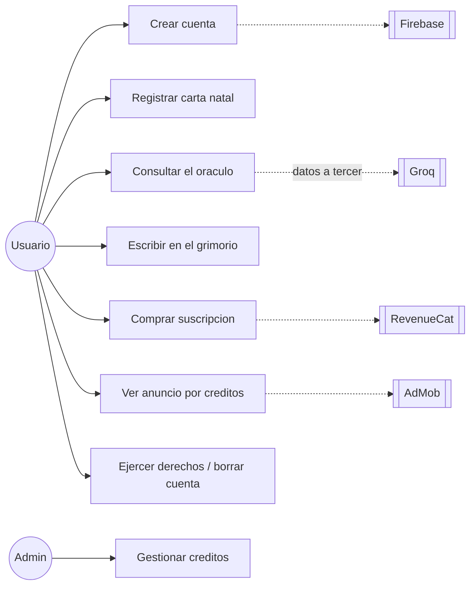
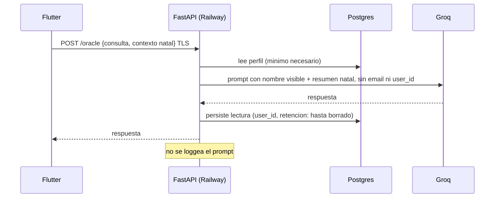
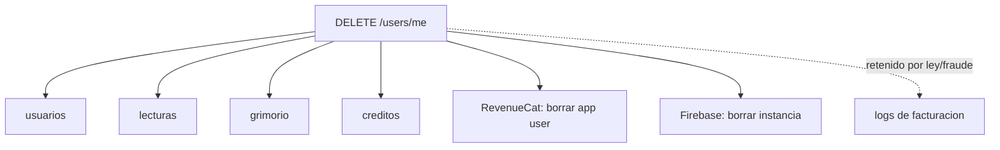

# Documentación legal-técnica: UML, casos de uso, flujo de datos, ROPA

Los diagramas aquí no son decoración: son la evidencia con la que se rellena el Data safety de Play, se sostiene el ROPA del GDPR y se contesta a un reviewer o a la SIC. Se generan **desde el código auditado**, nunca desde lo que dice la política.

Formato: Mermaid en Markdown, dentro de `docs/legal/`. Se renderiza en GitHub, en Obsidian y en un Artifact.

## 1. Casos de uso — quién toca datos personales

Un actor por rol real, y solo los casos de uso donde hay dato personal de por medio.

Regla: toda flecha punteada hacia un tercero exige, sí o sí, fila en la tabla de subencargados, base legal y mención en la política. Si aparece una flecha nueva y no hay fila, es un hallazgo de auditoría.

## 2. Flujo de datos (DFD) por feature

Uno por feature que salga del dispositivo. Debe mostrar: qué campo sale, hacia dónde, cifrado, dónde se persiste, cuánto se retiene.

## 3. ROPA — registro de actividades de tratamiento (GDPR art. 30)

Tabla en `docs/legal/ropa.md`, una fila por finalidad, no por campo:

`finalidad | categorías de interesados | categorías de datos | base legal | destinatarios | transferencia fuera del EEE | plazo de supresión | medidas de seguridad`

## 4. Mapa de retención y borrado

Diagrama del efecto cascada de `DELETE /users/me`: qué tablas se borran, qué queda, en qué tercero hay que propagar el borrado (RevenueCat, Firebase). Sirve para probar ante Play que el borrado es real.

Lo que aparezca en el nodo de retención debe estar declarado en la política, con plazo. Si nada se retiene, el nodo se elimina — no se deja "por si acaso".

## 5. Cuándo regenerar

Cada vez que: se añade un tercero, cambia un endpoint que toca datos personales, cambia el esquema de base de datos, o se prepara un release. Los diagramas viejos son peores que no tenerlos: se citan como verdad y mienten.
