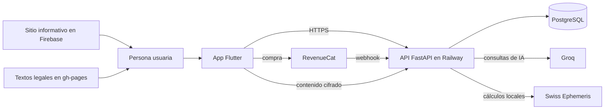

# Mapa de arquitectura de ARCANUM

Estado: mapa inicial verificado en el repositorio el 2026-10-07. Es un diagrama de contexto, no un inventario de clases.

El mapa resume integraciones. La app también usa Firebase en el cliente; este diagrama no describe todavía cada servicio de Firebase. El Grimorio cifra y descifra en Flutter antes de enviar contenido a la API. El servidor guarda `encrypted_content`; no dibujar una flecha de texto claro hacia PostgreSQL.

## Fuentes comprobadas

| Límite o flujo | Archivo de referencia |
|---|---|
| Navegación principal: Cielo, Horóscopo, Grimorio, Saber, Oráculo | [`arcanum_app/lib/core/router/app_router.dart`](../arcanum_app/lib/core/router/app_router.dart) |
| Cliente HTTP y operaciones del Grimorio | [`arcanum_app/lib/core/api/arcanum_api.dart`](../arcanum_app/lib/core/api/arcanum_api.dart) |
| Cifrado local del Grimorio | [`arcanum_app/lib/core/crypto/grimoire_crypto.dart`](../arcanum_app/lib/core/crypto/grimoire_crypto.dart) |
| Rutas del backend | [`arcanum-api/app/main.py`](../arcanum-api/app/main.py) |
| Modelos configurados para Groq | [`arcanum-api/app/core/config.py`](../arcanum-api/app/core/config.py) |
| Cálculo astral | [`arcanum-api/app/routers/astral.py`](../arcanum-api/app/routers/astral.py) |
| Webhook de pagos | [`arcanum-api/app/routers/revenuecat.py`](../arcanum-api/app/routers/revenuecat.py) |
| Sitio que publica Firebase | [`arcanum_app/firebase.json`](../arcanum_app/firebase.json) |

## Diagramas siguientes, solo cuando aporten una respuesta

1. **Secuencia del Grimorio:** crear entrada, cifrar en cliente, guardar, leer y descifrar. Útil para auditar privacidad y recuperación de clave.
2. **Secuencia de compra y créditos:** RevenueCat, webhook, idempotencia y saldo. Útil para depurar cobros.
3. **Flujo del Oráculo:** consentimiento, datos enviados, cuota, Groq y respuesta. Útil para privacidad y fallos 429.
4. **Modelo de datos acotado:** usuario, entrada de Grimorio, tirada, créditos y eventos de pago. Derivarlo de modelos y migraciones, sin copiar todo el esquema.

Usar Mermaid versionado junto al texto. UML de clases solo para relaciones complejas reales; un diagrama por pregunta, con fecha y fuentes. Si una figura no se puede contrastar con código o prueba, rotularla como propuesta.
