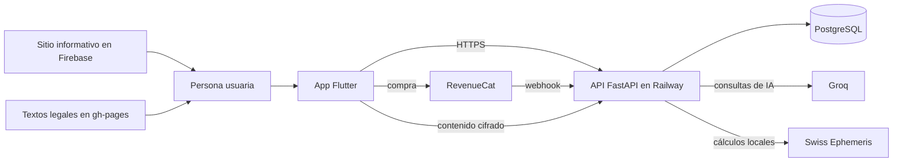
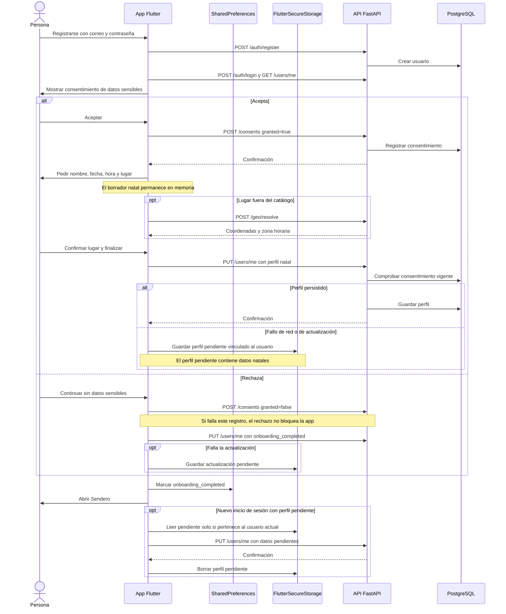

# Mapa de arquitectura de ARCANUM

Estado: contexto y dos secuencias verificados en el código el 2026-10-09. Describen el comportamiento implementado; falta comprobar los recorridos completos en Android.



El mapa resume integraciones. La app también usa Firebase en el cliente; este diagrama no describe todavía cada servicio de Firebase. El Grimorio cifra y descifra en Flutter antes de enviar contenido a la API. El servidor guarda `encrypted_content`; no dibujar una flecha de texto claro hacia PostgreSQL.

## Fuentes comprobadas

| Límite o flujo | Archivo de referencia |
|---|---|
| Navegación principal: Cielo, Horóscopo, Grimorio, Saber, Oráculo | [`arcanum_app/lib/core/router/app_router.dart`](../arcanum_app/lib/core/router/app_router.dart) |
| Cliente HTTP y operaciones del Grimorio | [`arcanum_app/lib/core/api/arcanum_api.dart`](../arcanum_app/lib/core/api/arcanum_api.dart) |
| Cifrado local del Grimorio | [`arcanum_app/lib/core/crypto/grimoire_crypto.dart`](../arcanum_app/lib/core/crypto/grimoire_crypto.dart) |
| Rutas del backend | [`arcanum-api/app/main.py`](../arcanum-api/app/main.py) |
| Modelos configurados para Groq | [`arcanum-api/app/core/config.py`](../arcanum-api/app/core/config.py) |
| Cálculo astral | [`arcanum-api/app/routers/astral.py`](../arcanum-api/app/routers/astral.py) |
| Webhook de pagos | [`arcanum-api/app/routers/revenuecat.py`](../arcanum-api/app/routers/revenuecat.py) |
| Sitio que publica Firebase | [`arcanum_app/firebase.json`](../arcanum_app/firebase.json) |

## Registro, consentimiento y perfil natal

**Pregunta:** ¿en qué momento salen los datos de nacimiento del dispositivo y qué ocurre si falla la red? El registro envía correo y contraseña, inicia sesión automáticamente y abre el onboarding. El consentimiento de datos sensibles se pide antes de capturar el perfil natal.



El borrador natal permanece en memoria; `SharedPreferences` solo conserva el indicador de onboarding completo. El perfil pendiente se guarda en `FlutterSecureStorage` con el ID de su cuenta y solo se reenvía a esa cuenta. Al iniciar la app se borran los campos natales heredados de `SharedPreferences`; el pendiente antiguo, sin dueño verificable, se descarta. Las coordenadas y la zona horaria confirmadas permanecen en memoria hasta el envío o el guardado seguro del perfil pendiente. La API rechaza datos natales en `/auth/register` y exige consentimiento vigente para escribirlos en `/users/me`. Si falla `POST /consents` al aceptar, no se avanza a los datos natales; al rechazar, el fallo se tolera. Revocar el consentimiento borra los campos natales y la carta natal calculada en la misma transacción e invalida la caché del Oráculo; el cliente elimina el pendiente local. Historiales y entradas de práctica se gestionan por separado: ver la [revisión de privacidad](legal/privacidad-onboarding.md). [Registro](../arcanum_app/lib/features/auth/register_screen.dart), [autenticación](../arcanum_app/lib/core/auth/auth_controller.dart), [consentimiento y navegación](../arcanum_app/lib/features/onboarding/presentation/onboarding_screen.dart), [borrador y reintento](../arcanum_app/lib/features/onboarding/application/onboarding_controller.dart), [almacén seguro](../arcanum_app/lib/features/onboarding/application/pending_profile_store.dart), [selector de lugar](../arcanum_app/lib/shared/widgets/place_chooser.dart), [API de registro](../arcanum-api/app/routers/auth.py), [API de perfil](../arcanum-api/app/routers/users.py), [API de consentimiento](../arcanum-api/app/routers/consents.py).

## Crear y leer una entrada del Grimorio

**Pregunta:** ¿qué información puede leer el servidor? El cuerpo se cifra en Flutter con AES-256-GCM antes de `POST /grimoire`. El título, el tipo y los metadatos de contexto viajan como campos separados. La lista devuelve estos campos; el detalle devuelve además el cuerpo cifrado y el IV.

```mermaid
sequenceDiagram
  actor Persona
  participant App as App Flutter
  participant Key as FlutterSecureStorage
  participant API as API FastAPI
  participant DB as PostgreSQL
  Persona->>App: Escribir título y cuerpo; sellar entrada
  App->>Key: Leer o crear clave local de 256 bits
  Key-->>App: Clave del dispositivo
  App->>App: Cifrar cuerpo con AES-256-GCM y nonce aleatorio
  opt Contexto astral disponible
    App->>API: Consultar Luna o cielo del día
    API-->>App: Contexto astral
  end
  App->>API: POST /grimoire con título, metadatos, cuerpo cifrado e IV
  API->>API: Calcular hora planetaria del usuario
  API->>DB: Guardar campos y contenido cifrado
  API-->>App: Entrada creada
  Persona->>App: Abrir entrada
  App->>API: GET /grimoire/{id}
  API->>DB: Buscar entrada del usuario autenticado
  DB-->>API: Campos, contenido cifrado e IV
  API-->>App: Entrada cifrada
  App->>Key: Leer clave local
  Key-->>App: Clave del dispositivo
  App->>App: Descifrar y autenticar cuerpo
  App->>Persona: Mostrar título y cuerpo
```

Las escrituras nuevas llevan prefijo `v2:` y usan AES-256-GCM; la lectura conserva soporte para entradas antiguas AES-256-CBC. La clave del Grimorio se crea y guarda en `FlutterSecureStorage` del dispositivo. Si no está la clave original o falla la autenticación del texto, el detalle no puede recuperar el cuerpo. El backend calcula la hora planetaria y no confía en la enviada por el cliente. El contexto astral opcional no impide guardar si falla su consulta. [Editor](../arcanum_app/lib/features/grimorio/grimorio_editor.dart), [cifrado](../arcanum_app/lib/core/crypto/grimoire_crypto.dart), [detalle](../arcanum_app/lib/features/grimorio/grimorio_detail.dart), [API del cliente](../arcanum_app/lib/core/api/arcanum_api.dart), [router del servidor](../arcanum-api/app/routers/grimoire.py), [modelo](../arcanum-api/app/models/grimoire_entry.py).

## Diagramas siguientes

1. **Compra y créditos:** RevenueCat, webhook, idempotencia y saldo, tras verificar el recorrido en código.
2. **Oráculo:** consentimiento, datos enviados, cuota, Groq y respuesta.
3. **Modelo de datos acotado:** usuario, entrada de Grimorio, tirada, créditos y eventos de pago, derivado de modelos y migraciones.

Mantener Mermaid junto al texto y corregir cada figura al cambiar su flujo. Usar UML de clases solo cuando una relación entre clases reales sea la pregunta.
